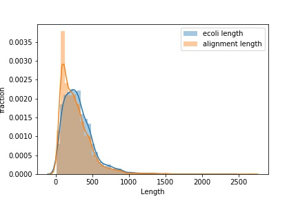
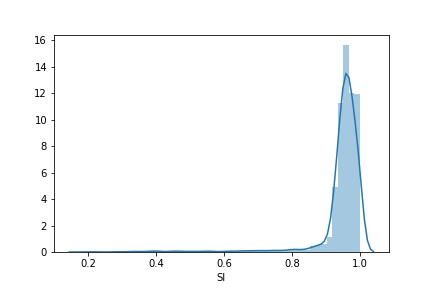
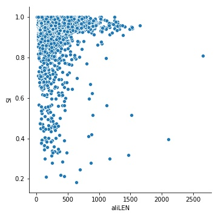
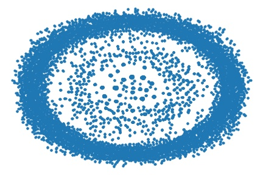

# algorithms-bioinformatics report
Wensi Zhu

### Introduction
My research is to make a dataset of *E coli*'s orthologues from bacteria proteomes. I used the *seaborn* package for this project to visualize my data. All my data is in `data/` folder and they are:

  - *ecoli_uniq_rem.fasta*: *E coli* proteins in a fasta file.
  - *rbh.m8*: output of running a reciprocal best hit process for *E coli* proteins and other bacteria proteomes (reference proteomes from Uniprot).

  
`project.ipynb` includes the excutable codes for testing. Since I am still working on my dataset, the analysis still requires further consideration. I plan to apply the visualization again when the dataset is completed. 

### Results
For the reciprocal best hit procedure, the query sequences are *E coli* proteins and the target sequences are all the proteins from reference proteomes. First I plotted the distribution of alignment lengths against the *E coli* protein lengths. 

From the Figure 1 we could see that the two distributions have large area in common, which we could infer that the query coverage is quite high. Then I plot the sequence identity distribution. 

The mean of the sequence identity is 0.947 with a standard deviation of 0.07. The high query coverage and the high sequence identity give a good reflection of the dataset. In addition, I also plotted the alignment length vs sequence identity. These two figures could later help me to filter the best hits with a certain sequence identity threshold.  

Besides, I also tried the apply the networkx plotting on my data even though the results might not be helpful by far. It is possible to find connections among the proteins. I used the query identifier and the target identifier as the edges. Since if the couple are the best hit of each other, the strong connection (might be orthologues) does exist between them. This is just an experiment and hopefully I could implement it when my dataset is done. 

I also tested plotting many figures but most of them are not significant nor meaningful, so that those are not included in the report. However, you could find some tests in the codes(`project.ipynb`).
